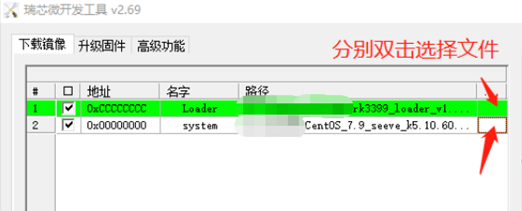
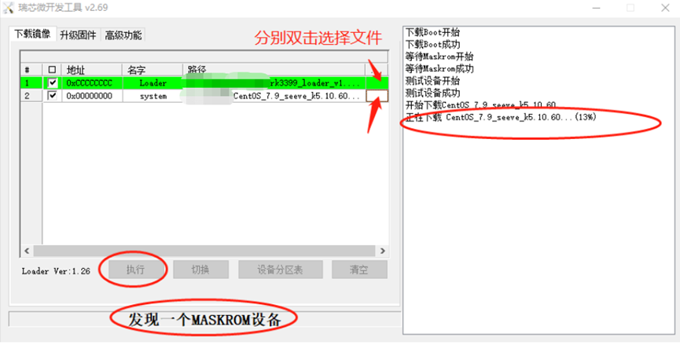

# SMART Technologies AM40

> 镜像下载：http://files.kos.org.cn/%E7%91%9E%E8%8A%AF%E5%BE%AE/am40/
>
> Armbian下载：https://github.com/ophub/amlogic-s9xxx-armbian/releases

## 规格参数

|   部件名称    |       芯片型号       |                           备注说明                           |
| :-----------: | :------------------: | :----------------------------------------------------------: |
|      CPU      |        RK3399        | Dual-core Cortex-A72 up to 1.8GHz;Quad-core Cortex-A53 up to 1.4GHz;Mali-T864 GPU |
|      RAM      |                      |                  Dual-channel DDR3 1GB * 4                   |
|     Flash     |                      |                         32G  eMMC 5.1                        |
|   Ethernet    |        RTL8211F      |                            10/100/1000                       |
|    WIFI+BT    |        RTL8822BE     |  802.11AC/ABGN PCIE WLAN WITH BLUETOOTH 4.2 SINGLE-CHIP CONTROLLER      |
|    USB 2.0    |                      |                        USB 2.0[ops]   * 4                    |
|    USB 3.0    |                      |                   USB 3.0 [on board] * 2                    |
|     HDMI      |                      |            HDMI 1.4[on board] + HDMI 2.0[ops]                |
|     power     |  12V5A ( 5V2A 12V1A works) |  PORT size： 5.5 * 2.5 [ops main]；3.0 * 1.1 [hided; on board]|

## 卡刷教程

###1. 将
> http://files.kos.org.cn/%E7%91%9E%E8%8A%AF%E5%BE%AE/am40/Armbian_23.02.2_am40_jammy_current_6.1.11.7z

解压出Armbian_23.02.2_am40_jammy_current_6.1.11.img,烧录到tf卡，插到机子上开机，即可启动外置系统 

###2. 如需装进emmc，ssh登陆后，将Armbian_23.02.2_am40_jammy_current_6.1.11.img上传到/root/,执行
```
dd if=Armbian_23.02.2_am40_jammy_current_6.1.11.img of=/dev/mmcblk2 bs=1M
```
 或者执行
```
armbian-install #选择安装到emmc，并且更新bootloader从emmc启动
```
###3. 完成后，关机拔掉tf卡，重新启动即可。

## 线刷教程
### 1.下载DriverAssitant_v5.1.1,AndroidTool,rk3399_loader_v1.24.126.bin 
安装DriverAssitant_v5.1.1,打开AndroidTool,如图选择rk3399_loader_v1.24.126.bin 作为 Loader, img结尾的armbian镜像作为 System(注意地址为0x00000000)

 

### 2.	插usb双公头到第一个usb3.0(上面的)，另一端接电脑

### 3.	针对内部系统为原版安卓系统，找到service开关，拨到service；
插电开机，打开瑞芯微开发工具，会发现一个adb设备，点击切换，


等待变成发现一个loader设备，
点击高级功能找到 进入maskrom 按钮，点击，然后等待发现一个maskrom设备；
 

4.	发现一个maskrom设备后，点击下载镜像标签，点击执行
 

5.	如果不是原版安卓系统，则需拆机 maskrom短接点相接 ，插usb双公头到第一个usb3.0(上面的)，另一端接电脑，插电开机，在刷机软件中观察是否进入maskrom模式；
 

6.	刷完记得把service开关，拨到normal；


### Linux烧写


1. 进入烧写模式

    同上进入 MaskRom 模式

    ```shell
    # 查看连接的设备
    ./rkbin/tools/upgrade_tool ld
    # 或使用 rkdeveloptool
    # 因 ./rkbin/tools/rkdeveloptool 这个不支持 ld 命令故需要重新编译 rkdeveloptool
    git clone https://github.com/rockchip-linux/rkdeveloptool.git
    sudo apt install -y libudev-dev libusb-dev dh-autoreconf libglib2.0-dev
    cd rkdeveloptool && autoreconf -i && ./configure && make
    sudo mv rkdeveloptool /usr/local/bin/
    rkdeveloptool ld

    # 应会有如下设备信息
    DevNo=1 Vid=0x2207,Pid=0x330c,LocationID=301    Loader
    # 或
    DevNo=1 Vid=0x2207,Pid=0x330c,LocationID=301    MaskRom

    # Loader 模式进入 MaskRom 模式方法
    ./rkbin/tools/upgrade_tool rd 3
    # 或
    rkdeveloptool rd 3
    ```

2. 初始化 DRAM

    需要在 MaskRom 模式下才下载，否则报错 “The device does not support this operation!”。

    ```shell
    # 初始化 DRAM
    ./rkbin/tools/upgrade_tool db ./rk3399_loader_v1.22.119.bin
    # 或
    rkdeveloptool db ./rk3399_loader_v1.22.119.bin
    
    # 下载镜像
    ./rkbin/tools/upgrade_tool wl 0x0 ./system.img
    # 或
    rkdeveloptool wl 0x0 ./system.img
    ```

#### SDCard

> 也可以使用图形化烧写工具 balena-etcher-electron
>
> https://github.com/balena-io/etcher/releases

```shell
# sdX 为 sdcard 对应的块设备文件
sudo dd if=system.img of=/dev/sdX bs=4M oflag=sync status=progress
```

### 串口调试

#### 串口选择

测试了市面上常见的几款 CH340G、PL2303HX 方案的串口，均存在只能读不能写问题，这将无法从串口打断 u-boot 启动和进行 shell 操作，建议使用 CP2104 方案的串口代替。

#### 通信软件

> 也可以使用 minicom 、putty、SecureCRT 等工具。

```shell
# 解决串口权限问题
sudo usermod -a -G dialout $USER
# 重新登录后生效
reboot

# 安装串口通信软件
sudo apt install -y python3-serial

# 打开串口
miniterm /dev/ttyUSB0 1500000

# 退出 miniterm 快捷键为 Ctrl + ]
```

## 系统配置

### 网络

#### 有线

```shell
# 使用 netplan 配置以太网络
sudo nano /etc/netplan/01-netcfg.yaml

# 配置为动态获取 IP
network:
  version: 2
  renderer: networkd
  ethernets:
    eth0:
      dhcp4: yes

# 或静态 IP
network:
  version: 2
  renderer: networkd
  ethernets:
    eth0:
     dhcp4: no
     addresses: [10.0.0.10/24]
     gateway4: 10.0.0.1
     nameservers:
       addresses: [223.5.5.5,223.6.6.6]

# 应用配置
sudo netplan --debug apply
```

#### 无线

```shell
# WiFi 配置
nmcli dev wifi connect "hotspot-name" password "password"

# 或使用 nmtui 命令图形化修改
```

#### 热点

使用 hostapd + isc-dhcp-server

```shell
sudo apt install -y hostapd isc-dhcp-server

# 配置 hostapd
sudo nano /etc/hostapd/hostapd.conf
interface=wlan0
driver=nl80211
ssid=hostspot-name
macaddr_acl=0
auth_algs=1
#auth_algs=3
ignore_broadcast_ssid=0
hw_mode=g
channel=6
wpa=2
wpa_passphrase=password
wpa_key_mgmt=WPA-PSK
wpa_pairwise=CCMP
#wpa_pairwise=TKIP
#rsn_pairwise=CCMP

# 修改 hostapd 默认配置文件路径
sudo nano /etc/default/hostapd
DAEMON_CONF=/etc/hostapd/hostapd.conf

# 重启 hostapd
sudo service hostapd restart
sudo service hostapd status

# dhcp 配置
sudo nano /etc/dhcp/dhcp.conf
#option domain-name "example.org";
#option domain-name-servers ns1.example.org, ns2.example.org;
authoritative;
subnet 10.0.0.0 netmask 255.255.255.0 {
    range 10.0.0.10 10.0.0.200;
    option broadcast-address 10.0.0.255;
    option routers 10.0.0.1;
    default-lease-time 600;
    max-lease-time 7200;
    option domain-name "local";
    option domain-name-servers 223.5.5.5, 8.8.4.4;
}

# 设置 dhcp 网口
# 不进行操作会出现错误：Not configured to listen on any interfaces!
sudo nano /etc/default/isc-dhcp-server
INTERFACESv4="wlan0"
INTERFACESv6="wlan0"

# 设置 wlan0 地址
# 不进行操作会出现错误：Not configured to listen on any interfaces!
sudo ip addr add 10.0.0.1/24 dev wlan0

# 开启转发
sudo sysctl -w net.ipv4.ip_forward=1
sudo iptables -t nat -A POSTROUTING -s 10.0.0.1/24 -o eth0 -j MASQUERADE

# 启动 dhcp 服务
sudo service isc-dhcp-server restart
sudo service isc-dhcp-server status
```

使用 network-manager + dnsmasq

```shell
# 此方按创建的 2.4G 热点会出现部分旧设备连接不上
sudo apt install -y dnsmasq
#nmcli dev wifi hotspot ifname wlan0 ssid "hotspot-name" password "password"
nmcli connection add type wifi ifname wlan0 con-name "Hostspot" autoconnect no ssid "hotspot-name"
nmcli connection modify "Hostspot" 802-11-wireless.mode ap 802-11-wireless.band bg ipv4.method shared
nmcli connection modify "Hostspot" wifi-sec.key-mgmt wpa-psk
nmcli connection modify "Hostspot" wifi-sec.psk "password"
nmcli connection up "Hostspot"

# 或使用 nmtui 命令图形化修改
```

### 镜像源

```shell
sudo cp -a /etc/apt/sources.list /etc/apt/sources.list.bak
sudo sed -i "s@http://ports.ubuntu.com@http://mirrors.huaweicloud.com@g" /etc/apt/sources.list
```

### 本地化

```shell
# 安装英文与简体中文语言包
sudo apt install -y language-pack-en language-pack-zh-hans
# 设置本地化
sudo dpkg-reconfigure locales

# 配置时区
sudo apt install -y tzdata
sudo dpkg-reconfigure tzdata
# 同步硬件时间
sudo hwclock -s
```

### 分区扩容

```shell
sudo apt install -y parted
sudo parted /dev/mmcblk2
unit s
print
resizepart 5 100%
print
Q

sudo resize2fs /dev/mmcblk2p5
```

### Docker

```shell
sudo apt install gnupg2 -y

# 添加 apt 公钥
curl -fsSL https://download.docker.com/linux/debian/gpg | sudo apt-key add -

# 添加软件源
echo "deb [arch=arm64] https://download.docker.com/linux/ubuntu $(lsb_release -cs) stable" | sudo tee /etc/apt/sources.list.d/docker.list

# 安装 docker
sudo apt update && sudo apt install docker-ce -y

# 非 root 用户免 sudo 操作 docker
sudo usermod -aG docker $USER
```

## 常见问题

Q：能进 MaskRom 模式，但下载 Loader 初始化 DRAM 总是失败。或 u-boot 无等待时间不能按 RECOVERY 键进入 MaskRom 模式。

A：插上带有系统的 SDCard，默认会从 SDcard 启动，连接串口并打开串口调试软件，开机后迅速在调试窗口按任意键，打断 u-boot 启动（如果不能打断请更换 CP2104 方案的串口），执行如下命令破坏 u-boot，重启后会自动进入 MaskRom 模式。

```shell
mmc dev 0
mmc erase 0 2000
reset
```
或者进入系统后
```
dd if=/dev/zero of=/dev/mmcblk2 bs=1M count=300
```
---

Q：使用 apt 安装软件包时出现如下警告：

> perl: warning: Setting locale failed.
> perl: warning: Please check that your locale settings:
>        LANGUAGE = (unset),
>        LC_ALL = (unset),
>        LANG = "zh_CN.UTF-8"
>    are supported and installed on your system.
> perl: warning: Falling back to the standard locale ("C").

A：参考 系统配置-本地化 一节安装相应语言包即可解决。

---

Q：以太网卡因未被 network-manager 托管不能启用。

```shell
# 网卡未启用
ip addr show eth0
2: eth0: <BROADCAST,MULTICAST> mtu 1500 qdisc noop state DOWN group default qlen 1000
    link/ether 16:a6:4c:50:54:44 brd ff:ff:ff:ff:ff:ff

# 网卡未被 network-manager
nmcli device
DEVICE  TYPE      STATE      CONNECTION
eth0    ethernet  unmanaged  --
lo      loopback  unmanaged  --

# 使用该命令启用网卡无效
nmcli dev set eth0 managed yes
```

A：原因在于 Ubuntu 更推荐使用 netplan 配置以太网络，默认的 network-manager 配置 /usr/lib/NetworkManager/conf.d/10-globally-managed-devices.conf 不会托管以太网卡[^7]。若要使用 network-manager 托管所有网络设备操作如下：

```shell
# 覆盖默认配置
sudo touch /etc/NetworkManager/conf.d/10-globally-managed-devices.conf
```

---

Q：如何获取当前系统的设备树和内核编译选项？

A：使用如下命令获取：

```shell
# 设备树
cat /sys/firmware/fdt > raw.dtb

# 内核编译选项
zcat /proc/config.gz > kernel.config
```

---

Q：如何连接蓝牙音箱？

A：使用如下命令连接：

```shell
sudo apt install -y bluez bluez-tools pulseaudio pulseaudio-module-bluetooth

# 查看蓝牙信息
hciconfig

# 使用 bluetoothctl 命令操作蓝牙
# 上电
power on
# 扫描
scan on
# 配对
pair MAC
# 信任
trust MAC
# 连接
connect MAC

# 如果连接时出现 Failed to connect: org.bluez.Error.Failed 可以通过重启 pulseaudio 解决
pulseaudio -k
pulseaudio --start

# 声道测试
speaker-test -c2 -twav

# 查看 PulseAudio 信息
pactl info

# 查看音频输出通道
pactl list sinks

# 设置为默认音频输出通道，通过 TAB 补全后面的名称
pactl set-default-sink bluez_sink.MAC.a2dp_sink
```

## 参考资料

[^1]: [Boot option - Rockchip open source Document](http://opensource.rock-chips.com/wiki_Boot_option)

[^2]: [U-Boot v2020.01 和 Linux 5.4 在 RK3399 上部署](https://aijishu.com/a/1060000000079034)

[^3]: [ATF - Rockchip open source Document](http://opensource.rock-chips.com/wiki_ATF)

[^4]: [U-Boot - Rockchip open source Document](http://opensource.rock-chips.com/wiki_U-Boot)

[^5]: [Rockchip Kernel - Rockchip open source Document](http://opensource.rock-chips.com/wiki_Rockchip_Kernel)

[^6]: [Rkdeveloptool - Rockchip open source Document](http://opensource.rock-chips.com/wiki_Rkdeveloptool)

[^7]: [network-manager does not manage ethernet and bluetooth interfaces](https://bugs.launchpad.net/ubuntu/+source/network-manager/+bug/1638842)

